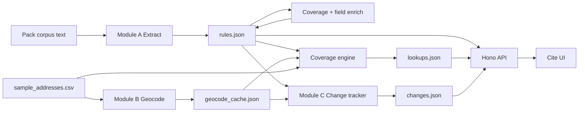

# Cite — Architecture

**Not legal advice.** Legal-information prototype for Hack-Nation × RealPage Challenge 02.

## Stack

| Layer | Tech |
|-------|------|
| Shared contracts | TypeScript + Zod (`shared/`) |
| Pipeline / API | Node.js, Hono, Anthropic SDK, Ajv, Census Geocoder |
| UI | Vite + TanStack Start / React (Lovable) |
| Data | Vendored pack under `data/pack/` (corpus, 500 addresses, schemas, T1–T5) |
| Artifacts | `outputs/rules.json`, `lookups.json`, `changes.json`, `geocode_cache.json`, `provenance.json`, `audit_log.jsonl` |

## Data flow

## Modules

### A — Extraction
- Reads capturable docs from `data/pack/corpus/text/`.
- Claude (when `ANTHROPIC_API_KEY` set) with schema-validated structured output; heuristic fallback offline.
- Every rule must have a `quoted_span` that appears **verbatim** in the source document (snap + reject).
- Link-only municipal pages (Hoboken / Jersey City) are **scaffolds** with FAIR Act (D069) quotes — never invented municipal code.
- Aliases `CA-ALG-01`, `NJ-ALG-01`, `HOB-ALG-01`, `JC-ALG-01`, `MA-ALG-P1/P2`, `MA-RENT-P1` for T1–T5.

### B — Jurisdiction + coverage
- Census Geocoder with offline cache / heuristic fallback.
- Distinguishes postal city vs legal city; untrusted `postal_fallback` never receives city-level rules.
- Temporal status: `in_force` / `not_yet_effective` / `pending` / `failed` evaluated against `as_of`.
- Coverage: dual plain-language + executable predicates; missing year/units/owner → `unknown` (never guessed `applies`).
- Pack `result` values stay organizer-compatible; enrichment adds `applicability`, `facts_used`, `facts_missing`, `needs_human_review`.

### C — Change tracking
- Implements pack `dev/change_tests.json` **T1–T5 only** (no hour-16 / T6).
- Deterministic affected sets + T3 conflict flags for Hoboken / Jersey City.

## Provenance & audit
- `outputs/audit_log.jsonl` — extract / test events.
- `outputs/provenance.json` — schema/pipeline versions + content hashes (companion; submission JSON stays pack-shaped).
- Quote offsets (`quote_start_offset` / `quote_end_offset`) when resolvable.

## Failure modes
| Condition | Behavior |
|-----------|----------|
| Missing building facts required by coverage | `unknown` |
| Untrusted geocode | No city rules |
| Pending / not yet effective | Shown as non-operative; not current law |
| Failed / struck measure | Omitted from applies (T5 empty set) |
| Unresolved local vs state conflict | `conflict_flag` + `needs_human_review` |
| Link-only primary ordinance | Scenario scaffold; live applicability `unknown` |
| No API key | Heuristic extract only |

## Offline demo
Without `VITE_API_URL`, UI loads corpus snapshots for fixed as-of dates. No browser-side legal evaluation.
